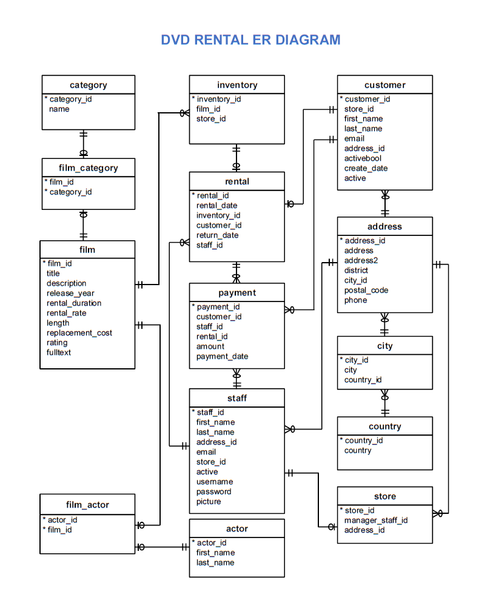

# Udacity Project: Investigate a Relational Database

## Nanodegree: Programming for Data Science

## Title: Investigate a Relational Database

## Description

In this project, we have used SQL to explore a database related to movie rentals. We have written SQL code to run SQL queries and answer some questions about the database. As part of your the project we have built visualizations to showcase the output of our queries.

Each slide of the presentation had to meet the next conditions:

* Have a question of interest.
* Have a supporting SQL query needed to answer the question.
* Have a supporting visualization created using the final data of your SQL query that answers your question of interest.

## Files used

**Sakila DVD Rental database:**  The database used to do the queries. It can be downloaded in this [link].(http://www.postgresqltutorial.com/postgresql-sample-database/).

**Queries.txt:** A text file with the four SQL querys used in the project.

**SQL_Project_Jesús_Mira_Aldao.pdf:** A pdf format file with with a question, a visualization, and small summary on each slide.

**SQL_Project_Jesús_Mira_Aldao.pptx:** The same file as before in ppt format.

**dvd-rental-erd-2.png:** The ER diagram of the DVD Rental database.

**README.md:** This README file.

## DVD Rental ER Diagram

## Queries

These are queries that we have decide to answer regarding this database in each slide:

### Slide 1: What is the average revenue per customer in the 10 countries with more active customers?

In this slide we can see the number of customers and the total payment received per customer. It is shown for the 10 countries with more customers.

### Slide 2: What are the 10 actors with more total payment amount? And what is the evolution of these actors along the months?

We have made a ranking of the 10 actors who generate more revenue, and we have seen their evolution in this ranking month by month.

### Slide 3: Number of rentals per day of week for the three categories with more and less rentals.

We have seen each one of this six categories per day of week and their evolution. The result was filtered for films with rating NC-17 or R. For example, Music had more rentals at the end of the week, and games had more rentals at the start of the week.

### Slide 4: Box Plot comparison for Drama Category between the two stores.

Drama is the category with the biggest difference of payments amount in the two stores.
We have compared the quartile values for each store on this category. We have seen also two outliers that can distort the total
results.

